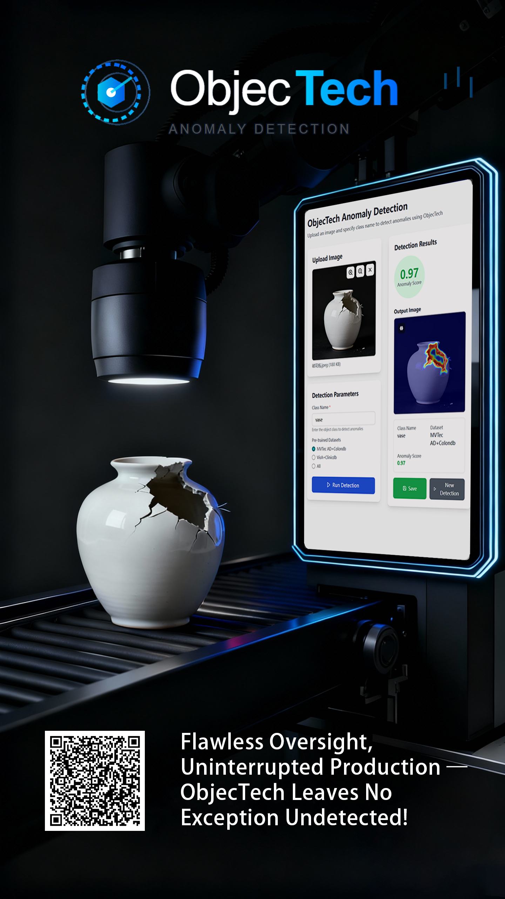
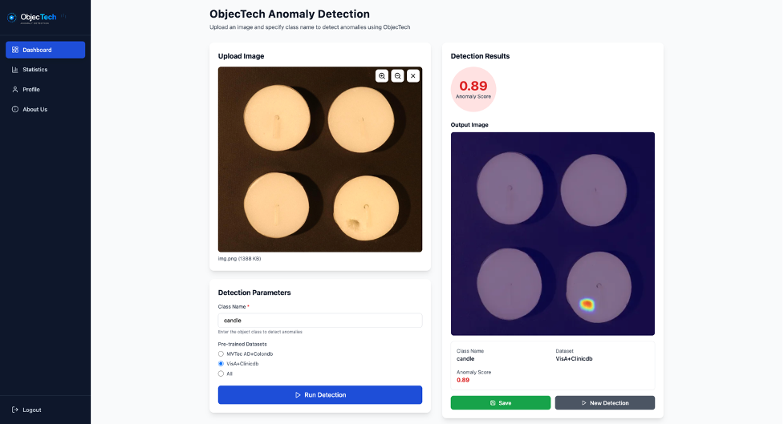
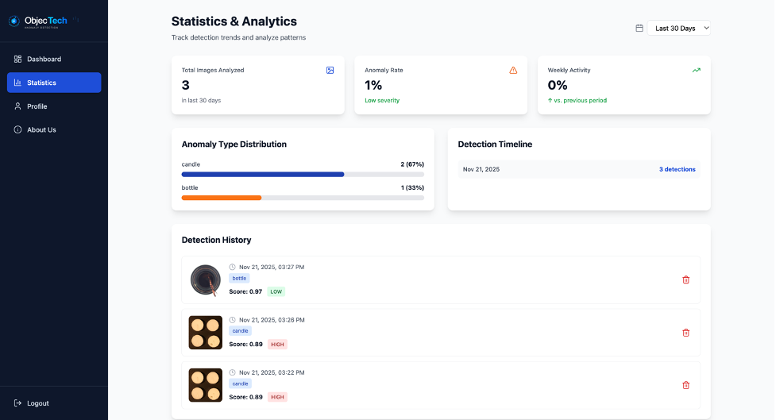

# **# ObjecTech**

ObjecTech is an efficient anomaly detection web management system designed to help users upload images, identify anomalies in real time, view historical records, and manage personal image resources.It improves safety and productivity by detecting potential issues early.

------


## **🚀** 

## **Live Demo / Landing Page**


- **Live App:** https://project-test-five-zeta.vercel.app/
- **Landing Page:** https://244319751.hs-sites-na2.com/en-us/real-time-ai-anomaly-detection-for-industrial-insights-objectech-alpha
- **GitHub Repository:** https://github.com/qinnnngneeeei/ObjecTech
- **Demo Video:** https://res.cloudinary.com/dydmrj8i3/video/upload/v1763708959/ObjecTech_diijh8.mp4


------


## **🖼 Poster**

> 替换成你仓库中的图片路径（例如 ./assets/poster.png）

```

```

------


# **## App Access Instructions**


## **1. Overview**


This document provides clear instructions for assessors to access, test, and experience the **ObjecTech – Real-Time AI Anomaly Detection Platform**.

You may open the app directly or access it through our landing page.

We have also open-sourced this project on GitHub so developers may clone and run it locally.

------


## **2. How to Access**


### **Option A — Direct Access (Recommended)**


🔗 https://project-test-five-zeta.vercel.app/

- No installation required
- 3–5s loading time
- Works on browsers and mobile
- Full functionality enabled

------


### **Option B — Via Landing Page**


🔗 https://244319751.hs-sites-na2.com/en-us/real-time-ai-anomaly-detection-for-industrial-insights-objectech-alpha

Steps:

1. Scroll to **“Try ObjecTech Alpha Now”**
2. Click the button to enter the app

------


## **3. Test Account**


You may sign up using any email and password.

Alternatively, use the test account:

```
Email: test@example.com
Password: 123456 (or any)
```

> Test data is temporary and will not be stored.

------


## **4. Features to Test**


### **1. Dashboard — Image Upload & Anomaly Detection**

- Upload industrial images
- Choose a model (Pre-trained Dataset)
- Run real-time anomaly detection
- View anomaly heatmap
- Save results to **Statistics**

```

```

------


### **2. Statistics**

- View detection history
- Explore category-based statistics
- Visualize usage metrics

```

```

------


## **5. Known Issues**

- Images > 8MB may load slower
- Cold start may delay initial load
- Only supports: .jpg, .jpeg, .png


------


## **6. Recommended Browsers**

- Google Chrome (Best)
- Safari / Edge
- Works on PC / Mac / iOS / Android

------


# **## 🛠 Local Development Guide**


## **1. Clone or download**

```
git clone https://github.com/qinnnngneeeei/ObjecTech.git
cd ObjecTech
```

Or unzip & enter folder:

```
cd project0
```

------


## **2. Install Node.js**

This project requires Node.js (recommended Node 18+).

Download: https://nodejs.org/en/download

Check:

```
node -v
npm -v
```

------


## **3. Install dependencies**

```
npm install
```

------


## **4. Start dev server**

```
npm run dev
```

Output example:

```
VITE v5.x.x ready in xxx ms
➜ Local: http://localhost:5173/
```

------


## **5. Open in browser**

👉 http://localhost:5173/

------


## **6. Troubleshooting**

- **npm not found** → reinstall Node
- **Missing env** → check .env
- **Port in use** → npm run dev -- --port 3000

------


# **## ✔ Done**

If you need assistance, feel free to contact us.

